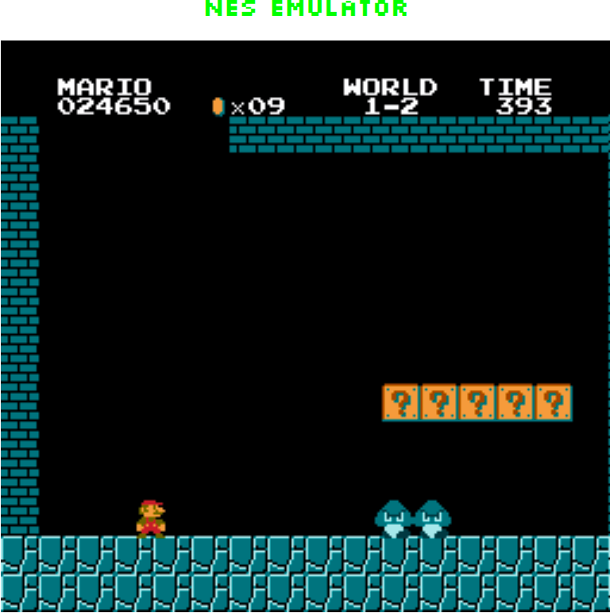
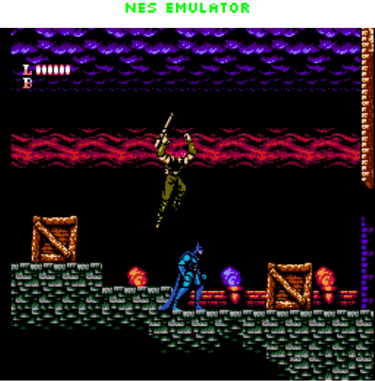
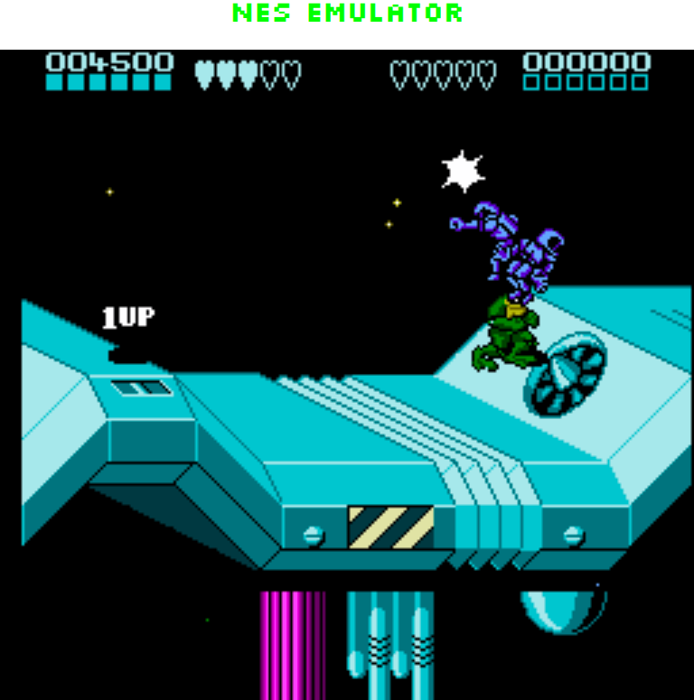
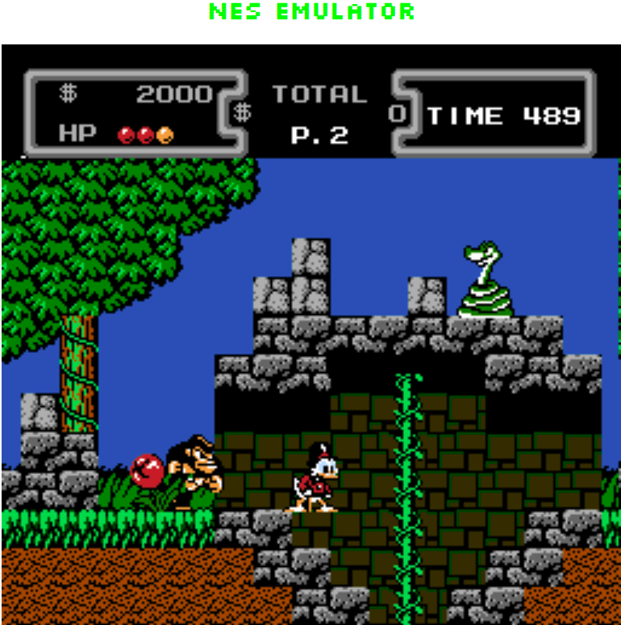
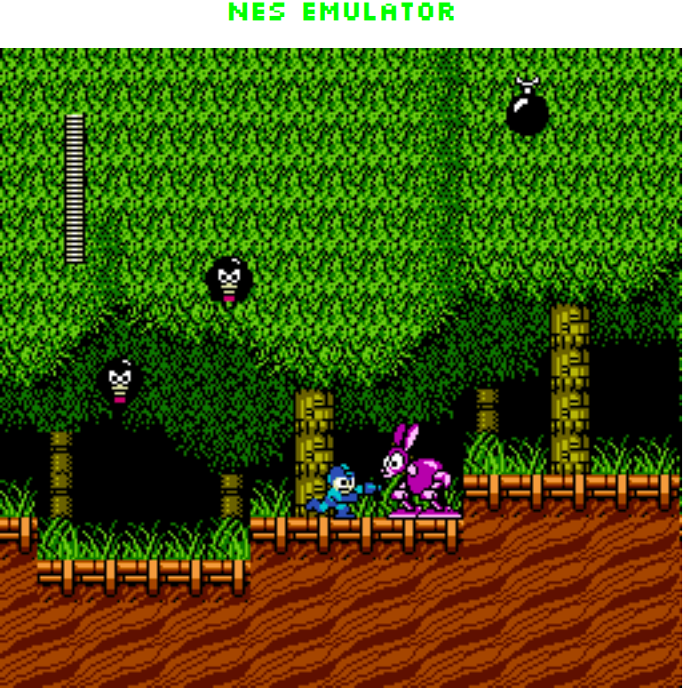
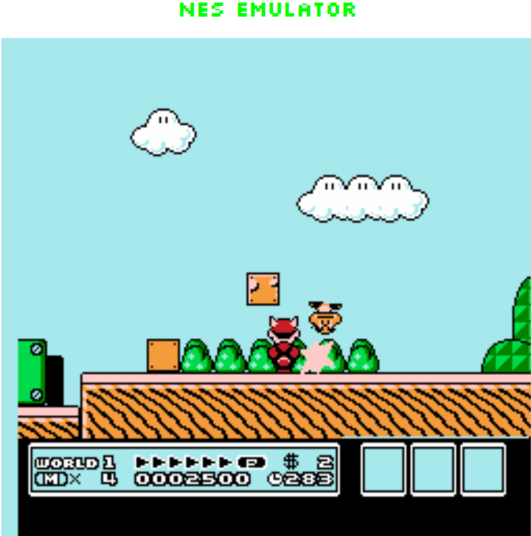

<b><h2>A Nintendo Entertainment System (NES) emulator implemented in JavaScript.</h2></b>

<br>

One way to play on this emulator is to start a local <b>http-server</b> using the script <b>server.js</b> that I have included in the root folder. Install [http-server](https://www.npmjs.com/package/http-server) and run
```console
foo@bar:~$ node server.js
```
from the root folder of the project. Then go to <b>localhost:8080</b> in a browser and load a game.


<br><br>

 💻 <b>CPU</b>
  - All official instructions are implemented
  - nestest passes :heavy_check_mark:
  - NEStress CPU tests passes :heavy_check_mark:
  - NES 6502 Timing test passes :heavy_check_mark:
  - NES 6502 Branch Timing test passes :heavy_check_mark:
    - 1.Branch_Basics.nes :heavy_check_mark:
    - 2.Backward_Branch.nes :heavy_check_mark:
    - 3.Forward_Branch.nes :heavy_check_mark:

<br><br>

<b>🖥️ PPU</b>
- Implemented as NTSC
- NTSC NES PPU tests passes :heavy_check_mark:
  - palette_ram.nes :heavy_check_mark:
  - sprite_ram.nes :heavy_check_mark:
  - vbl_clear_time.nes :heavy_check_mark:
  - vram_access.nes :heavy_check_mark:
- NES OAM Read test passes :heavy_check_mark:
  
<br><br>

:musical_note:  <b>APU</b>
  - All five channels (Square1, Square2, Triangle, Noise, DMC) are implemented
  - The APU needs some polishing but sounds decent most of the time

<br><br>

🔌 <b>Cartridge</b>
  - Most of the available NES games can be played on this emulator
  - Implemented mappers are:
      - Mapper 0: NROM
      - Mapper 1: MMC1
      - Mapper 2: UxROM
      - Mapper 3: CNROM
      - Mapper 4: MMC3
      - Mapper 7: AxROM
      - Mapper 9: MMC2
      - Mapper 66: GxROM
      - Mapper 69: JxROM

<br><br>
        
  

 

 


<br><br>
:video_game: <b>Controls</b>
- Support for controller 1 and 2
- It is possible to configure controller 1 and 2 (configuration is stored in local storage)

<table>
<tr><th>Controller 1 </th><th>Controller 2</th></tr>
<tr><td>

|Input | Keyboard Key(s)|
|--|--|
|Up | Arrow Up |
|Down | Arrow Down |
|Left | Arrow Left |
|Right | Arrow Right |
| A     |	Z               |
 | B	    | X               |
 | Select|	A               |
 | Start	| S            |

</td><td>

|Input|Keyboard Key(s)| 
|--|--|
|Up|U|
 | Down    	| J          |
| Left    	| H          |
| Right    	| K          |
 | A     |	G               |
 | B	    | F               |
 | Select|	R               |
 | Start	| T            |

</td></tr> </table>


